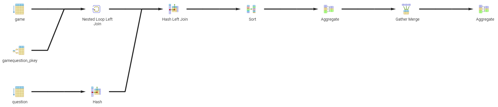

**Ausgabe aller Spieler (Spielername), die in einem bestimmten Zeitraum gespielt haben:**

SELECT DISTINCT g.player.username
FROM Game g
WHERE g.starttime BETWEEN :starttime AND :endtime;

z.B. starttime = '2024-02-26' und endtime = '2024-02-28'

**Ausgabe zu einem bestimmten Spieler: Alle Spiele (Id, Datum), sowie die Anzahl der korrekten Antworten pro Spiel mit Angabe der Gesamtanzahl der Fragen pro Spiel bzw. alternativ den Prozentsatz der korrekt beantworteten Fragen:**

SELECT g.gameId, g.startTime,
COUNT(q.questionId) AS totalQuestions,
SUM(CASE WHEN gq.isCorrect = true THEN 1 ELSE 0 END) AS correctAnswers
FROM Game g
LEFT JOIN GameQuestion gq ON g.gameId = gq.game_id
LEFT JOIN Question q ON gq.question_id = q.questionId
WHERE g.player_playerid = 5
GROUP BY g.gameId, g.startTime;

**Ausgabe aller Spieler mit Anzahl der gespielten Spiele, nach Anzahl absteigend geordnet:**

SELECT p.username, COUNT(p.playerid) AS gespielteSpiele
FROM game g
JOIN player p ON g.player_playerid = p.playerid
GROUP BY p.username
ORDER BY gespielteSpiele DESC

**Ausgabe der am meisten gefragten Kategorie, oder alternativ, die Beliebtheit der Kategorien nach Anzahl der Auswahl absteigend sortiert:**

SELECT c.name AS category_name, COUNT(q.questionid) AS category_count
FROM gamequestion gq
JOIN question q ON gq.question_id = q.questionid
JOIN category c ON c.categoryid = q.category_categoryid
GROUP BY c.categoryid
ORDER BY category_count DESC