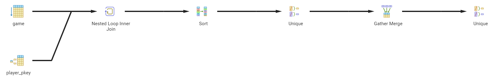
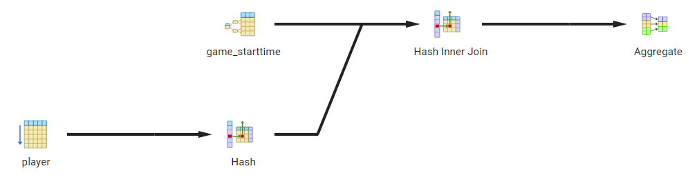
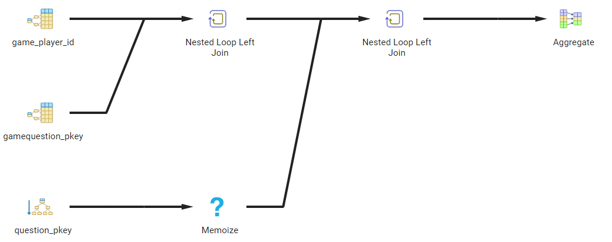
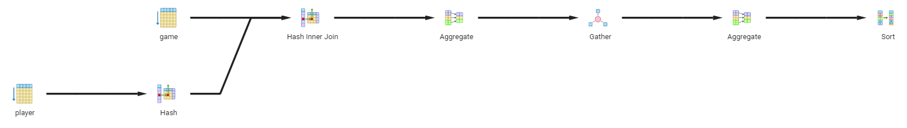
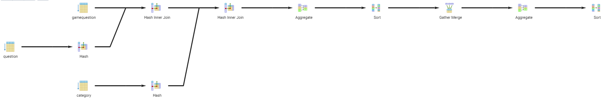
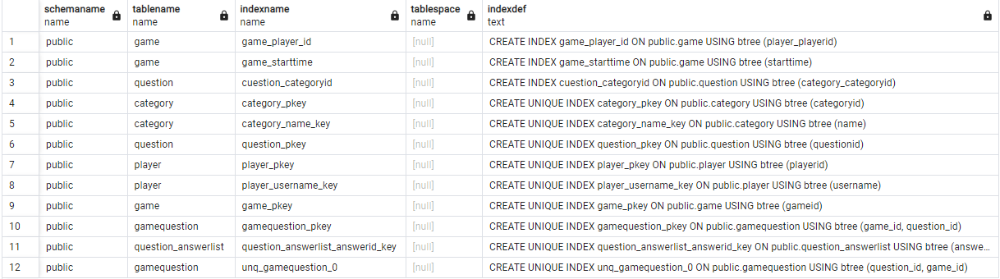

**Ausgabe aller Spieler (Spielername), die in einem bestimmten Zeitraum gespielt haben:**

```sql
SELECT DISTINCT p.username
FROM Game g
JOIN player p on g.player_playerid = p.playerid
WHERE g.starttime BETWEEN '2024-02-26' AND '2024-02-28';
```


Das oben stehende Explain hatte Gesamtkosten von 28714.62. Nachdem wir einen Index für die Spalte starttime und player_playerid erstellt haben erhielt wir ein neues Explain:



Die Kosten betragen hierbei 3054.64.

**Ausgabe zu einem bestimmten Spieler: Alle Spiele (Id, Datum), sowie die Anzahl der korrekten Antworten pro Spiel mit Angabe der Gesamtanzahl der Fragen pro Spiel bzw. alternativ den Prozentsatz der korrekt beantworteten Fragen:**

```sql
SELECT g.gameId, g.startTime,
COUNT(q.questionId) AS totalQuestions,
SUM(CASE WHEN gq.isCorrect = true THEN 1 ELSE 0 END) AS correctAnswers
FROM Game g
LEFT JOIN GameQuestion gq ON g.gameId = gq.game_id
LEFT JOIN Question q ON gq.question_id = q.questionId
WHERE g.player_playerid = 5
GROUP BY g.gameId, g.startTime;
```


Ursprünglich verursachte unsere Anfrage Kosten von cost 27199.4. Da wir einen Index für player_playerid und starttime in game erstellt haben, erhielten wir den folgenden neuen Explain:



Die Kosten betragen nach der Optimierung 6558.03.


**Ausgabe aller Spieler mit Anzahl der gespielten Spiele, nach Anzahl absteigend geordnet:**

```sql
SELECT p.username, COUNT(p.playerid) AS gespielteSpiele
FROM game g
JOIN player p ON g.player_playerid = p.playerid
GROUP BY p.username
ORDER BY gespielteSpiele DESC
```



Etwaige Indizes für besipielsweise username oder player_playerid, sind bereits in unserem Schema vorhanden. Am Ende betragen unsere Kosten der Anfrage 37031.74

**Ausgabe der am meisten gefragten Kategorie, oder alternativ, die Beliebtheit der Kategorien nach Anzahl der Auswahl absteigend sortiert:**

```sql
SELECT c.name AS category_name, COUNT(q.questionid) AS category_count
FROM gamequestion gq
JOIN question q ON gq.question_id = q.questionid
JOIN category c ON c.categoryid = q.category_categoryid
GROUP BY c.name
ORDER BY category_count DESC
```



Trotz der Erstellung eines zusätzlichen Index auf der Relation question für die Spalte category_categoryid, kommen wir auf Gesamtkosten von 232815.86.


**Unsere Indizes**



